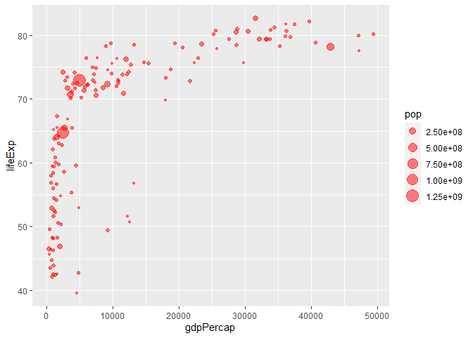
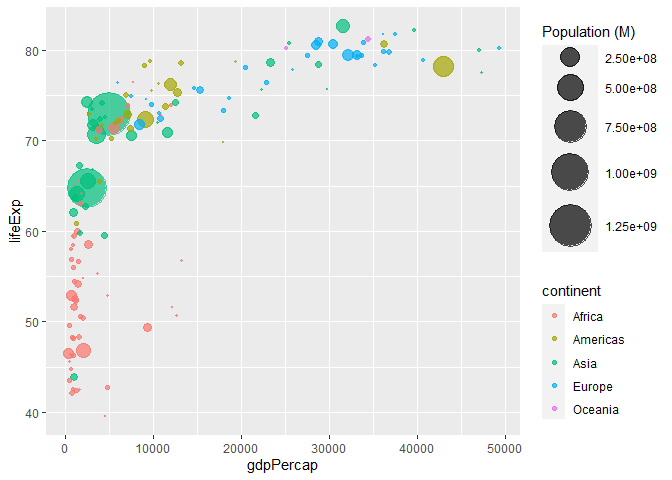

GGplot2- Bubble Chart Variations
================
Shefali C.

Gapminder data has been used to create the following bubble charts.
Starting with the most basic bubble chart, plots progress to an
interactive version towards the end.  
Gapminder dataset contains GDP per capita, life expectancy, population
of countries from year 1952 to 2007.

``` r
#libraries required for manipulation and viz
library(dplyr)
library(ggplot2)
#library required for data
library(gapminder)
#virdis package for nice color palette
library(viridis)
#hrbrthemes for theme_ipsum() function
library(hrbrthemes)
#for interactive plots
library(plotly)
#for saving the interactive widget
library(htmlwidgets)
```

``` r
#taking stats for year 2007
data <- gapminder::gapminder %>% 
  filter(year == 2007) %>% 
  select(-year)
```

Following is the basic version of a bubble chart, size of the bubbles
vary with the population of the country.

``` r
#Most basic bubble plot
ggplot(data = data, aes(x = gdpPercap, y = lifeExp, size = pop))+
  geom_point(color = "red", alpha = 0.5)
```

<!-- -->

In the following code:  
1. *`arrange(desc(pop))`*- ensures that countries get sorted in
descending order of population so that larger bubbles stay on top of the
chart.  
2. *`country = factor(country, country)`*- ensures that levels in the
country column are in the order of descending population.  
3. *`scale_size()`*- sets the size of smallest and largest bubbles.
*name* parameter sets the name of the legend.

``` r
#following code scales the size of bubbles based on population.
#in prev plot, not much difference between large vs small pop countries.
#scale_size() sets the size of biggest and smallest bubble. 
#in order to avoid bigger bubble overlapping smaller bubble, reordering has been done.

data %>% 
  arrange(desc(pop)) %>% 
  mutate(country = factor(x = country, levels = country)) %>% 
  ggplot(aes(x = gdpPercap, y = lifeExp, size = pop)) + 
  geom_point(alpha = 0.7) + 
  #scale_size() scales area of the viz element, here bubble,
  #name parameter sets name of the legend.
  scale_size(range = c(0.1, 15), name = "Population (in Millions)")
```

<!-- -->

The above plot can be further enhanced by adding color parameter based
on continent of the countries.

``` r
#Adding a 4th dimension- color representing Continent.
data %>% 
  arrange(desc(pop)) %>% 
  mutate(country = factor(x = country, levels = country)) %>% 
  ggplot(aes(x = gdpPercap, y = lifeExp, size = pop, color = continent))+
  geom_point(alpha = 0.7)+
  scale_size(range = c(0.1, 15), name = "Population (M)")
```

<!-- -->

*`Viridis`* package offers better palettes, here “rocket” has been
used.  
*`theme_ipsum()`* function of *hrbrthemes* package sets the plot theme
including size, font appearance, position etc of the titles, subtitles,
axis labels and so on.

``` r
#making the bubble chart prettier
data %>% 
  arrange(desc(pop)) %>% 
  mutate(country = factor(x = country, levels = country)) %>% 
  ggplot(aes(x = gdpPercap, y = lifeExp, fill = continent, size = pop))+
  geom_point(alpha = 0.5, shape = 21, color = "black")+
  scale_size(range = c(0.1, 15), name = "Population (M)")+
  viridis::scale_fill_viridis(discrete = TRUE, option = "rocket", guide = "none")+
  hrbrthemes::theme_ipsum()+
  #theme(legend.position = "bottom")+
  xlab("GDP per capita")+
  ylab("Life Expectancy")+
  theme(legend.position = "none")
```

<!-- -->

In the following code:  
1. The 3 columns *lifeExp*, *pop* and *gdpPercap* has been rounded off
to fit in the tooltip of the interactive plot.  
2. A *text* column has been added to store the content of the tooltip.  
Remaining portion of the code is same as above.

``` r
#Making the bubble plot interactive
p <- data %>% 
      mutate(lifeExp = round(lifeExp, 1),
             pop = round(pop/1000000, 2),
             gdpPercap = round(gdpPercap, 0)) %>% 
      #reordering data to have big bubbles on top
      arrange(desc(pop)) %>% 
      mutate(country = factor(x = country, levels = country)) %>% 
      #creating text for tooltip in interative version
      mutate(text = paste("Country: ", country, "\nPopulation: ", pop,
                          "\nLife Expectancy: ", lifeExp, "\nGDP per capita: ", gdpPercap, sep = "")) %>% 
      
      #main plot code
      ggplot(aes(x = gdpPercap, y = lifeExp, size = pop, fill = continent, text = text))+
      geom_point(shape = 21, color = "black", alpha = 0.5)+
      scale_size(range = c(0.1, 15), name = "Population(M)")+
      scale_fill_viridis(option = "rocket", guide = FALSE, discrete = TRUE)+
      theme_ipsum()+
      xlab("GDP per capita")+
      ylab("Life Expectancy")+
      theme(legend.position = "none")
```

*`ggplotly`* function of *plotly* package converts the simple plot above
into interactive type. The tooltip parameter takes in the column
containing content for the tip.

``` r
#interactive version
interactive_p <- plotly::ggplotly(p = ggplot2::last_plot(), tooltip = "text")
interactive_p
```

<div id="htmlwidget-c77ee81d1cc1c27d7734" style="width:672px;height:480px;" class="plotly html-widget"></div>
<script type="application/json" data-for="htmlwidget-c77ee81d1cc1c27d7734">{"x":{"data":[{"x":[2014,5581,691,278,9270,2602,1107,1463,3820,6223,1056,1328,824,1045,1545,2042,1217,759,620,4797,470,1712,1043,1271,7093,1704,943,926,863,430,1441,863,12057,883,641,706,3633,1803,415,4811,1569,753,12570,579,13206,10957,4513,7670,986,12154,2082,1598],"y":[46.9,71.3,52.9,46.5,49.3,58.6,52.5,54.1,71.2,72.3,51.5,60,42.1,59.4,48.3,50.4,52.3,48.3,56.9,42.7,43.5,63.1,54.5,42.4,73.9,50.7,56,48.2,46.2,49.6,56.7,42.6,74,58.4,58,44.7,55.3,64.2,45.7,52.9,42.6,59.4,50.7,46.4,56.7,72.8,39.6,76.4,65.2,51.6,54.8,65.5],"text":["Country: Nigeria<br />Population: 135.03<br />Life Expectancy: 46.9<br />GDP per capita: 2014","Country: Egypt<br />Population: 80.26<br />Life Expectancy: 71.3<br />GDP per capita: 5581","Country: Ethiopia<br />Population: 76.51<br />Life Expectancy: 52.9<br />GDP per capita: 691","Country: Congo, Dem. Rep.<br />Population: 64.61<br />Life Expectancy: 46.5<br />GDP per capita: 278","Country: South Africa<br />Population: 44<br />Life Expectancy: 49.3<br />GDP per capita: 9270","Country: Sudan<br />Population: 42.29<br />Life Expectancy: 58.6<br />GDP per capita: 2602","Country: Tanzania<br />Population: 38.14<br />Life Expectancy: 52.5<br />GDP per capita: 1107","Country: Kenya<br />Population: 35.61<br />Life Expectancy: 54.1<br />GDP per capita: 1463","Country: Morocco<br />Population: 33.76<br />Life Expectancy: 71.2<br />GDP per capita: 3820","Country: Algeria<br />Population: 33.33<br />Life Expectancy: 72.3<br />GDP per capita: 6223","Country: Uganda<br />Population: 29.17<br />Life Expectancy: 51.5<br />GDP per capita: 1056","Country: Ghana<br />Population: 22.87<br />Life Expectancy: 60<br />GDP per capita: 1328","Country: Mozambique<br />Population: 19.95<br />Life Expectancy: 42.1<br />GDP per capita: 824","Country: Madagascar<br />Population: 19.17<br />Life Expectancy: 59.4<br />GDP per capita: 1045","Country: Cote d'Ivoire<br />Population: 18.01<br />Life Expectancy: 48.3<br />GDP per capita: 1545","Country: Cameroon<br />Population: 17.7<br />Life Expectancy: 50.4<br />GDP per capita: 2042","Country: Burkina Faso<br />Population: 14.33<br />Life Expectancy: 52.3<br />GDP per capita: 1217","Country: Malawi<br />Population: 13.33<br />Life Expectancy: 48.3<br />GDP per capita: 759","Country: Niger<br />Population: 12.89<br />Life Expectancy: 56.9<br />GDP per capita: 620","Country: Angola<br />Population: 12.42<br />Life Expectancy: 42.7<br />GDP per capita: 4797","Country: Zimbabwe<br />Population: 12.31<br />Life Expectancy: 43.5<br />GDP per capita: 470","Country: Senegal<br />Population: 12.27<br />Life Expectancy: 63.1<br />GDP per capita: 1712","Country: Mali<br />Population: 12.03<br />Life Expectancy: 54.5<br />GDP per capita: 1043","Country: Zambia<br />Population: 11.75<br />Life Expectancy: 42.4<br />GDP per capita: 1271","Country: Tunisia<br />Population: 10.28<br />Life Expectancy: 73.9<br />GDP per capita: 7093","Country: Chad<br />Population: 10.24<br />Life Expectancy: 50.7<br />GDP per capita: 1704","Country: Guinea<br />Population: 9.95<br />Life Expectancy: 56<br />GDP per capita: 943","Country: Somalia<br />Population: 9.12<br />Life Expectancy: 48.2<br />GDP per capita: 926","Country: Rwanda<br />Population: 8.86<br />Life Expectancy: 46.2<br />GDP per capita: 863","Country: Burundi<br />Population: 8.39<br />Life Expectancy: 49.6<br />GDP per capita: 430","Country: Benin<br />Population: 8.08<br />Life Expectancy: 56.7<br />GDP per capita: 1441","Country: Sierra Leone<br />Population: 6.14<br />Life Expectancy: 42.6<br />GDP per capita: 863","Country: Libya<br />Population: 6.04<br />Life Expectancy: 74<br />GDP per capita: 12057","Country: Togo<br />Population: 5.7<br />Life Expectancy: 58.4<br />GDP per capita: 883","Country: Eritrea<br />Population: 4.91<br />Life Expectancy: 58<br />GDP per capita: 641","Country: Central African Republic<br />Population: 4.37<br />Life Expectancy: 44.7<br />GDP per capita: 706","Country: Congo, Rep.<br />Population: 3.8<br />Life Expectancy: 55.3<br />GDP per capita: 3633","Country: Mauritania<br />Population: 3.27<br />Life Expectancy: 64.2<br />GDP per capita: 1803","Country: Liberia<br />Population: 3.19<br />Life Expectancy: 45.7<br />GDP per capita: 415","Country: Namibia<br />Population: 2.06<br />Life Expectancy: 52.9<br />GDP per capita: 4811","Country: Lesotho<br />Population: 2.01<br />Life Expectancy: 42.6<br />GDP per capita: 1569","Country: Gambia<br />Population: 1.69<br />Life Expectancy: 59.4<br />GDP per capita: 753","Country: Botswana<br />Population: 1.64<br />Life Expectancy: 50.7<br />GDP per capita: 12570","Country: Guinea-Bissau<br />Population: 1.47<br />Life Expectancy: 46.4<br />GDP per capita: 579","Country: Gabon<br />Population: 1.45<br />Life Expectancy: 56.7<br />GDP per capita: 13206","Country: Mauritius<br />Population: 1.25<br />Life Expectancy: 72.8<br />GDP per capita: 10957","Country: Swaziland<br />Population: 1.13<br />Life Expectancy: 39.6<br />GDP per capita: 4513","Country: Reunion<br />Population: 0.8<br />Life Expectancy: 76.4<br />GDP per capita: 7670","Country: Comoros<br />Population: 0.71<br />Life Expectancy: 65.2<br />GDP per capita: 986","Country: Equatorial Guinea<br />Population: 0.55<br />Life Expectancy: 51.6<br />GDP per capita: 12154","Country: Djibouti<br />Population: 0.5<br />Life Expectancy: 54.8<br />GDP per capita: 2082","Country: Sao Tome and Principe<br />Population: 0.2<br />Life Expectancy: 65.5<br />GDP per capita: 1598"],"type":"scatter","mode":"markers","marker":{"autocolorscale":false,"color":"rgba(3,5,26,1)","opacity":0.5,"size":[18.3865663196335,14.254927712455,13.9260323184903,12.8249232838387,10.6421282031354,10.4397711510612,9.93086250816028,9.60685349587032,9.36253705199693,9.30479232032546,8.72554562224901,7.76231123558828,7.27035415036606,7.13288002178796,6.92309322110239,6.86588097036787,6.20781231241685,5.99773353625273,5.90276880625378,5.7994921100306,5.77503558471994,5.76611478055771,5.71227667378182,5.64877055398685,5.30194406471441,5.29216452912471,5.2206723108142,5.00996222815631,4.94195613883092,4.8163785418679,4.73156875463059,4.15785209201895,4.12589970699782,4.01516258793015,3.74382374019505,3.54500362555687,3.32060039810666,3.09536920145155,3.05972941032048,2.49311401662423,2.46449075876356,2.27108148368266,2.23904653604148,2.12574123436853,2.11192450794138,1.96716411722942,1.87359762666281,1.57928362527165,1.48552509170945,1.29548436316508,1.22742196008304,0.377952755905512],"symbol":"circle","line":{"width":1.88976377952756,"color":"rgba(0,0,0,1)"}},"hoveron":"points","name":"Africa","legendgroup":"Africa","showlegend":true,"xaxis":"x","yaxis":"y","hoverinfo":"text","frame":null},{"x":[42952,9066,11978,7007,12779,36319,7409,11416,13172,6873,5186,8948,6025,3822,1202,3548,5728,4173,2749,9645,19329,10611,9809,7321,18009],"y":[78.2,72.4,76.2,72.9,75.3,80.7,71.4,73.7,78.6,75,70.3,78.3,72.2,65.6,60.9,70.2,71.9,71.8,72.9,78.8,78.7,76.4,75.5,72.6,69.8],"text":["Country: United States<br />Population: 301.14<br />Life Expectancy: 78.2<br />GDP per capita: 42952","Country: Brazil<br />Population: 190.01<br />Life Expectancy: 72.4<br />GDP per capita: 9066","Country: Mexico<br />Population: 108.7<br />Life Expectancy: 76.2<br />GDP per capita: 11978","Country: Colombia<br />Population: 44.23<br />Life Expectancy: 72.9<br />GDP per capita: 7007","Country: Argentina<br />Population: 40.3<br />Life Expectancy: 75.3<br />GDP per capita: 12779","Country: Canada<br />Population: 33.39<br />Life Expectancy: 80.7<br />GDP per capita: 36319","Country: Peru<br />Population: 28.67<br />Life Expectancy: 71.4<br />GDP per capita: 7409","Country: Venezuela<br />Population: 26.08<br />Life Expectancy: 73.7<br />GDP per capita: 11416","Country: Chile<br />Population: 16.28<br />Life Expectancy: 78.6<br />GDP per capita: 13172","Country: Ecuador<br />Population: 13.76<br />Life Expectancy: 75<br />GDP per capita: 6873","Country: Guatemala<br />Population: 12.57<br />Life Expectancy: 70.3<br />GDP per capita: 5186","Country: Cuba<br />Population: 11.42<br />Life Expectancy: 78.3<br />GDP per capita: 8948","Country: Dominican Republic<br />Population: 9.32<br />Life Expectancy: 72.2<br />GDP per capita: 6025","Country: Bolivia<br />Population: 9.12<br />Life Expectancy: 65.6<br />GDP per capita: 3822","Country: Haiti<br />Population: 8.5<br />Life Expectancy: 60.9<br />GDP per capita: 1202","Country: Honduras<br />Population: 7.48<br />Life Expectancy: 70.2<br />GDP per capita: 3548","Country: El Salvador<br />Population: 6.94<br />Life Expectancy: 71.9<br />GDP per capita: 5728","Country: Paraguay<br />Population: 6.67<br />Life Expectancy: 71.8<br />GDP per capita: 4173","Country: Nicaragua<br />Population: 5.68<br />Life Expectancy: 72.9<br />GDP per capita: 2749","Country: Costa Rica<br />Population: 4.13<br />Life Expectancy: 78.8<br />GDP per capita: 9645","Country: Puerto Rico<br />Population: 3.94<br />Life Expectancy: 78.7<br />GDP per capita: 19329","Country: Uruguay<br />Population: 3.45<br />Life Expectancy: 76.4<br />GDP per capita: 10611","Country: Panama<br />Population: 3.24<br />Life Expectancy: 75.5<br />GDP per capita: 9809","Country: Jamaica<br />Population: 2.78<br />Life Expectancy: 72.6<br />GDP per capita: 7321","Country: Trinidad and Tobago<br />Population: 1.06<br />Life Expectancy: 69.8<br />GDP per capita: 18009"],"type":"scatter","mode":"markers","marker":{"autocolorscale":false,"color":"rgba(97,31,83,1)","opacity":0.5,"size":[27.2825794154546,21.7451006605947,16.5327637297084,10.6690422361451,10.1990316081709,9.3128721284943,8.65319555883797,8.2678100420112,6.59708846644807,6.08901451216758,5.83266520779059,5.57292749490477,5.06160272541844,5.00996222815631,4.84608540442204,4.56254071730182,4.40435315014602,4.32288139895835,4.00854345627191,3.45251497968349,3.37727281990004,3.17389819454191,3.08205932659378,2.86908546776082,1.81620889768226],"symbol":"circle","line":{"width":1.88976377952756,"color":"rgba(0,0,0,1)"}},"hoveron":"points","name":"Americas","legendgroup":"Americas","showlegend":true,"xaxis":"x","yaxis":"y","hoverinfo":"text","frame":null},{"x":[4959,2452,3541,2606,1391,31656,3190,2442,11606,7458,23348,944,975,1091,21655,4471,12452,1593,28718,2281,3970,4185,1714,39725,25523,4519,47143,3025,10461,22316,3096,47307,29796],"y":[73,64.7,70.7,65.5,64.1,82.6,71.7,74.2,71,70.6,78.6,62.1,43.8,63.8,72.8,59.5,74.2,67.3,78.4,62.7,72.4,74.1,59.7,82.2,80.7,72.5,80,73.4,72,75.6,66.8,77.6,75.6],"text":["Country: China<br />Population: 1318.68<br />Life Expectancy: 73<br />GDP per capita: 4959","Country: India<br />Population: 1110.4<br />Life Expectancy: 64.7<br />GDP per capita: 2452","Country: Indonesia<br />Population: 223.55<br />Life Expectancy: 70.7<br />GDP per capita: 3541","Country: Pakistan<br />Population: 169.27<br />Life Expectancy: 65.5<br />GDP per capita: 2606","Country: Bangladesh<br />Population: 150.45<br />Life Expectancy: 64.1<br />GDP per capita: 1391","Country: Japan<br />Population: 127.47<br />Life Expectancy: 82.6<br />GDP per capita: 31656","Country: Philippines<br />Population: 91.08<br />Life Expectancy: 71.7<br />GDP per capita: 3190","Country: Vietnam<br />Population: 85.26<br />Life Expectancy: 74.2<br />GDP per capita: 2442","Country: Iran<br />Population: 69.45<br />Life Expectancy: 71<br />GDP per capita: 11606","Country: Thailand<br />Population: 65.07<br />Life Expectancy: 70.6<br />GDP per capita: 7458","Country: Korea, Rep.<br />Population: 49.04<br />Life Expectancy: 78.6<br />GDP per capita: 23348","Country: Myanmar<br />Population: 47.76<br />Life Expectancy: 62.1<br />GDP per capita: 944","Country: Afghanistan<br />Population: 31.89<br />Life Expectancy: 43.8<br />GDP per capita: 975","Country: Nepal<br />Population: 28.9<br />Life Expectancy: 63.8<br />GDP per capita: 1091","Country: Saudi Arabia<br />Population: 27.6<br />Life Expectancy: 72.8<br />GDP per capita: 21655","Country: Iraq<br />Population: 27.5<br />Life Expectancy: 59.5<br />GDP per capita: 4471","Country: Malaysia<br />Population: 24.82<br />Life Expectancy: 74.2<br />GDP per capita: 12452","Country: Korea, Dem. Rep.<br />Population: 23.3<br />Life Expectancy: 67.3<br />GDP per capita: 1593","Country: Taiwan<br />Population: 23.17<br />Life Expectancy: 78.4<br />GDP per capita: 28718","Country: Yemen, Rep.<br />Population: 22.21<br />Life Expectancy: 62.7<br />GDP per capita: 2281","Country: Sri Lanka<br />Population: 20.38<br />Life Expectancy: 72.4<br />GDP per capita: 3970","Country: Syria<br />Population: 19.31<br />Life Expectancy: 74.1<br />GDP per capita: 4185","Country: Cambodia<br />Population: 14.13<br />Life Expectancy: 59.7<br />GDP per capita: 1714","Country: Hong Kong, China<br />Population: 6.98<br />Life Expectancy: 82.2<br />GDP per capita: 39725","Country: Israel<br />Population: 6.43<br />Life Expectancy: 80.7<br />GDP per capita: 25523","Country: Jordan<br />Population: 6.05<br />Life Expectancy: 72.5<br />GDP per capita: 4519","Country: Singapore<br />Population: 4.55<br />Life Expectancy: 80<br />GDP per capita: 47143","Country: West Bank and Gaza<br />Population: 4.02<br />Life Expectancy: 73.4<br />GDP per capita: 3025","Country: Lebanon<br />Population: 3.92<br />Life Expectancy: 72<br />GDP per capita: 10461","Country: Oman<br />Population: 3.2<br />Life Expectancy: 75.6<br />GDP per capita: 22316","Country: Mongolia<br />Population: 2.87<br />Life Expectancy: 66.8<br />GDP per capita: 3096","Country: Kuwait<br />Population: 2.51<br />Life Expectancy: 77.6<br />GDP per capita: 47307","Country: Bahrain<br />Population: 0.71<br />Life Expectancy: 75.6<br />GDP per capita: 29796"],"type":"scatter","mode":"markers","marker":{"autocolorscale":false,"color":"rgba(203,27,79,1)","opacity":0.5,"size":[56.6929133858268,52.0538020669338,23.5561679163929,20.5439771393409,19.3884839433914,17.8744065303356,15.1629473758487,14.6816958356779,13.2841084671137,12.8692907739403,11.2165939445476,11.0736212710749,9.10863397505631,8.68655483605518,8.49620036040334,8.48137249851949,8.07334986677392,7.83201477074963,7.8110105442796,7.65402550932144,7.34498134397955,7.15776013277768,6.1664065358669,4.41628325153358,4.249022847715,4.12910719320838,3.61263511562292,3.40918137820358,3.3692424974201,3.06421024327712,2.91216300107646,2.73513413461064,1.48552509170945],"symbol":"circle","line":{"width":1.88976377952756,"color":"rgba(0,0,0,1)"}},"hoveron":"points","name":"Asia","legendgroup":"Asia","showlegend":true,"xaxis":"x","yaxis":"y","hoverinfo":"text","frame":null},{"x":[32170,8458,30470,33203,28570,28821,15390,10808,36798,27538,20510,33693,22833,9787,18009,33860,36126,37506,10681,35278,18678,33207,49357,7446,14619,40676,5937,25768,9254,36181],"y":[79.4,71.8,80.7,79.4,80.5,80.9,75.6,72.5,79.8,79.5,78.1,79.4,76.5,74,73.3,80.9,79.8,81.7,73,78.3,74.7,79.3,80.2,74.9,75.7,78.9,76.4,77.9,74.5,81.8],"text":["Country: Germany<br />Population: 82.4<br />Life Expectancy: 79.4<br />GDP per capita: 32170","Country: Turkey<br />Population: 71.16<br />Life Expectancy: 71.8<br />GDP per capita: 8458","Country: France<br />Population: 61.08<br />Life Expectancy: 80.7<br />GDP per capita: 30470","Country: United Kingdom<br />Population: 60.78<br />Life Expectancy: 79.4<br />GDP per capita: 33203","Country: Italy<br />Population: 58.15<br />Life Expectancy: 80.5<br />GDP per capita: 28570","Country: Spain<br />Population: 40.45<br />Life Expectancy: 80.9<br />GDP per capita: 28821","Country: Poland<br />Population: 38.52<br />Life Expectancy: 75.6<br />GDP per capita: 15390","Country: Romania<br />Population: 22.28<br />Life Expectancy: 72.5<br />GDP per capita: 10808","Country: Netherlands<br />Population: 16.57<br />Life Expectancy: 79.8<br />GDP per capita: 36798","Country: Greece<br />Population: 10.71<br />Life Expectancy: 79.5<br />GDP per capita: 27538","Country: Portugal<br />Population: 10.64<br />Life Expectancy: 78.1<br />GDP per capita: 20510","Country: Belgium<br />Population: 10.39<br />Life Expectancy: 79.4<br />GDP per capita: 33693","Country: Czech Republic<br />Population: 10.23<br />Life Expectancy: 76.5<br />GDP per capita: 22833","Country: Serbia<br />Population: 10.15<br />Life Expectancy: 74<br />GDP per capita: 9787","Country: Hungary<br />Population: 9.96<br />Life Expectancy: 73.3<br />GDP per capita: 18009","Country: Sweden<br />Population: 9.03<br />Life Expectancy: 80.9<br />GDP per capita: 33860","Country: Austria<br />Population: 8.2<br />Life Expectancy: 79.8<br />GDP per capita: 36126","Country: Switzerland<br />Population: 7.55<br />Life Expectancy: 81.7<br />GDP per capita: 37506","Country: Bulgaria<br />Population: 7.32<br />Life Expectancy: 73<br />GDP per capita: 10681","Country: Denmark<br />Population: 5.47<br />Life Expectancy: 78.3<br />GDP per capita: 35278","Country: Slovak Republic<br />Population: 5.45<br />Life Expectancy: 74.7<br />GDP per capita: 18678","Country: Finland<br />Population: 5.24<br />Life Expectancy: 79.3<br />GDP per capita: 33207","Country: Norway<br />Population: 4.63<br />Life Expectancy: 80.2<br />GDP per capita: 49357","Country: Bosnia and Herzegovina<br />Population: 4.55<br />Life Expectancy: 74.9<br />GDP per capita: 7446","Country: Croatia<br />Population: 4.49<br />Life Expectancy: 75.7<br />GDP per capita: 14619","Country: Ireland<br />Population: 4.11<br />Life Expectancy: 78.9<br />GDP per capita: 40676","Country: Albania<br />Population: 3.6<br />Life Expectancy: 76.4<br />GDP per capita: 5937","Country: Slovenia<br />Population: 2.01<br />Life Expectancy: 77.9<br />GDP per capita: 25768","Country: Montenegro<br />Population: 0.68<br />Life Expectancy: 74.5<br />GDP per capita: 9254","Country: Iceland<br />Population: 0.3<br />Life Expectancy: 81.8<br />GDP per capita: 36181"],"type":"scatter","mode":"markers","marker":{"autocolorscale":false,"color":"rgba(244,135,94,1)","opacity":0.5,"size":[14.4391700753201,13.4424834951389,12.4790383694837,12.4491861269535,12.1842505070531,10.2173830639487,9.97858340070844,7.66558663550358,6.65291838534897,5.40587287996326,5.38910111968809,5.32873818010531,5.28971660280932,5.27008909633924,5.22315512028513,4.98653522477458,4.76459286376635,4.58261079868699,4.5163007569737,3.93829968891566,3.93153739044076,3.85974040086791,3.64224380950749,3.61263511562292,3.59024950161532,3.44468168740449,3.23769223009799,2.46449075876356,1.45245575085415,0.868394029605704],"symbol":"circle","line":{"width":1.88976377952756,"color":"rgba(0,0,0,1)"}},"hoveron":"points","name":"Europe","legendgroup":"Europe","showlegend":true,"xaxis":"x","yaxis":"y","hoverinfo":"text","frame":null},{"x":[34435,25185],"y":[81.2,80.2],"text":["Country: Australia<br />Population: 20.43<br />Life Expectancy: 81.2<br />GDP per capita: 34435","Country: New Zealand<br />Population: 4.12<br />Life Expectancy: 80.2<br />GDP per capita: 25185"],"type":"scatter","mode":"markers","marker":{"autocolorscale":false,"color":"rgba(250,235,221,1)","opacity":0.5,"size":[7.35360711005146,3.4486008314081],"symbol":"circle","line":{"width":1.88976377952756,"color":"rgba(0,0,0,1)"}},"hoveron":"points","name":"Oceania","legendgroup":"Oceania","showlegend":true,"xaxis":"x","yaxis":"y","hoverinfo":"text","frame":null}],"layout":{"margin":{"t":71.7907845579078,"r":39.8505603985056,"b":86.8410128684101,"l":70.9007887090079},"font":{"color":"rgba(0,0,0,1)","family":"Arial Narrow","size":15.2760481527605},"xaxis":{"domain":[0,1],"automargin":true,"type":"linear","autorange":false,"range":[-2175.95,51810.95],"tickmode":"array","ticktext":["0","10000","20000","30000","40000","50000"],"tickvals":[0,10000,20000,30000,40000,50000],"categoryorder":"array","categoryarray":["0","10000","20000","30000","40000","50000"],"nticks":null,"ticks":"","tickcolor":null,"ticklen":3.81901203819012,"tickwidth":0,"showticklabels":true,"tickfont":{"color":"rgba(77,77,77,1)","family":"Arial Narrow","size":15.2760481527605},"tickangle":-0,"showline":false,"linecolor":null,"linewidth":0,"showgrid":true,"gridcolor":"rgba(204,204,204,1)","gridwidth":0.265670402656704,"zeroline":false,"anchor":"y","title":{"text":"GDP per capita","font":{"color":"rgba(0,0,0,1)","family":"Arial Narrow","size":11.9551681195517}},"hoverformat":".2f"},"yaxis":{"domain":[0,1],"automargin":true,"type":"linear","autorange":false,"range":[37.45,84.75],"tickmode":"array","ticktext":["40","50","60","70","80"],"tickvals":[40,50,60,70,80],"categoryorder":"array","categoryarray":["40","50","60","70","80"],"nticks":null,"ticks":"","tickcolor":null,"ticklen":3.81901203819012,"tickwidth":0,"showticklabels":true,"tickfont":{"color":"rgba(77,77,77,1)","family":"Arial Narrow","size":15.2760481527605},"tickangle":-0,"showline":false,"linecolor":null,"linewidth":0,"showgrid":true,"gridcolor":"rgba(204,204,204,1)","gridwidth":0.265670402656704,"zeroline":false,"anchor":"x","title":{"text":"Life Expectancy","font":{"color":"rgba(0,0,0,1)","family":"Arial Narrow","size":11.9551681195517}},"hoverformat":".2f"},"shapes":[{"type":"rect","fillcolor":null,"line":{"color":null,"width":0,"linetype":[]},"yref":"paper","xref":"paper","x0":0,"x1":1,"y0":0,"y1":1}],"showlegend":false,"legend":{"bgcolor":null,"bordercolor":null,"borderwidth":0,"font":{"color":"rgba(0,0,0,1)","family":"Arial Narrow","size":12.2208385222084}},"hovermode":"closest","barmode":"relative"},"config":{"doubleClick":"reset","modeBarButtonsToAdd":["hoverclosest","hovercompare"],"showSendToCloud":false},"source":"A","attrs":{"bc863e61f14":{"x":{},"y":{},"size":{},"fill":{},"text":{},"type":"scatter"}},"cur_data":"bc863e61f14","visdat":{"bc863e61f14":["function (y) ","x"]},"highlight":{"on":"plotly_click","persistent":false,"dynamic":false,"selectize":false,"opacityDim":0.2,"selected":{"opacity":1},"debounce":0},"shinyEvents":["plotly_hover","plotly_click","plotly_selected","plotly_relayout","plotly_brushed","plotly_brushing","plotly_clickannotation","plotly_doubleclick","plotly_deselect","plotly_afterplot","plotly_sunburstclick"],"base_url":"https://plot.ly"},"evals":[],"jsHooks":[]}</script>

``` r
#saving the widget
htmlwidgets::saveWidget(widget = interactive_p, 
                        file = paste0(getwd(),"/gdp_vs_life_expectancy.html"))
```
