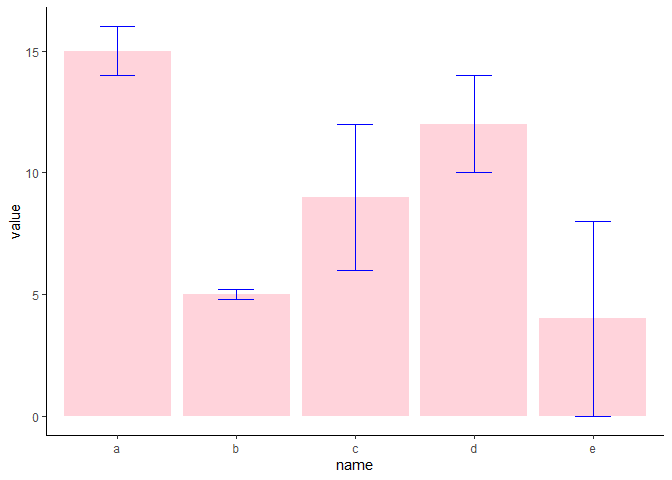
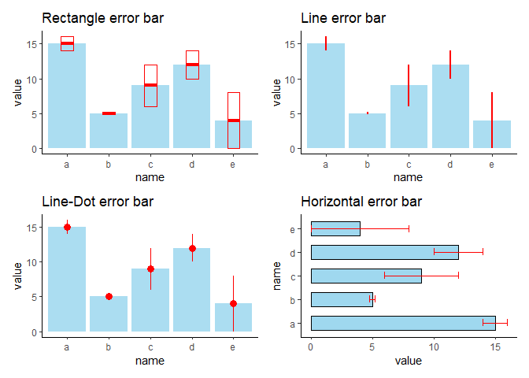
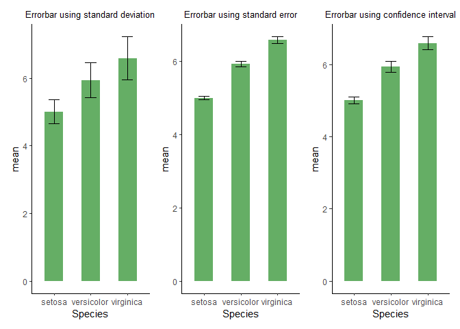

Barplots with Errorbars in R
================
Shefali C.

## RGraphGallery- Error Bars

Source- [Barplot with
errorbar](https://r-graph-gallery.com/4-barplot-with-error-bar.html)

Error bars are used to represent the uncertainty in a reported
measurement. They represent the margin of error in the measured values.
In R, error bars can be charted on a barplot using *`geom_errorbar()`*
function of ggplot2 package.

There are several variations of error-bars and different functions are
used to create them. They are:  
1. *Crossbar*- shape is rectangular instead of a line. Function used:
*`geom_crossbar()`*.  
2. *Line Error bar*- Shape is a single line with no whiskers. Function
used: *`geom_linerange()`*.  
3. *Line-Dot*- Shape is a line with a dot at the classmark-mid point on
the bar. Function used: *`geom_pointrange()`*.  
4. *Horizontal Error bar*- same as crossbar, except here,
*`coord_flip()`* is used to flip the barchart from vertical to
horizontal.

``` r
library(ggplot2)
library(dplyr)
library(patchwork)
```

``` r
#Creating basic Error plot
#dummy data
df1 <- data.frame(
        name = letters[1:5],
        value = sample(seq(4,15),5),
        sd = c(1, 0.2, 3, 2, 4)
        )
```

#### A basic error-plot

``` r
#error bar plot
ggplot(data = df1) + 
  geom_bar(aes(x = name, y = value), stat = "identity", alpha = 0.7, fill = "pink")+
  geom_errorbar(mapping = aes(x = name, ymin = value-sd, ymax = value + sd),
                width = 0.3, color = "blue", size = 0.7)+
  theme_classic()
```

<!-- -->

#### Different types of error-bars

``` r
#Rectangle Error-bar
p1 <- ggplot(data = df1)+
  geom_bar(aes(x = name, y = value), stat = "identity", alpha = 0.7, fill = "skyblue")+
  geom_crossbar(aes(x = name, y =value, ymin = value-sd, ymax = value+sd),
                width = 0.3, color = "red", size = 0.7)+
  theme_classic()+
  ggtitle("Rectangle error bar")
```

``` r
#Line Error-bar
p2 <- ggplot(data = df1)+
  geom_bar(aes(x = name, y =value), stat = "identity", alpha = 0.7, fill = "skyblue")+
  geom_linerange(aes(x = name, ymin = value-sd, ymax = value+sd),
                 color = "red", size = 1)+
  theme_classic()+
  ggtitle("Line error bar")
```

``` r
#line + dot
p3 <- ggplot(data = df1)+
  geom_bar(aes(x = name, y = value), stat = "identity", alpha = 0.7, fill = "skyblue")+
  geom_pointrange(aes(x = name, y = value, ymin = value-sd, ymax = value+sd),
                  color = "red", size = 0.6)+
  theme_classic()+
  ggtitle("Line-Dot error bar")
```

``` r
#horizontal error-bars
p4 <- ggplot(data = df1)+
  geom_bar(aes(x = name, y = value), stat = "identity", alpha = 0.8, fill = "skyblue", width = 0.6, color = "black")+
  geom_errorbar(aes(x = name, ymin = value-sd, ymax = value+sd),
                width = 0.3, color = "red", size = 0.7)+
  coord_flip()+
  theme_classic()+
  ggtitle("Horizontal error bar")
```

``` r
#patching all 4 plots above to display as 1 image
p1+p2+p3+p4
```

<!-- -->

#### Creating Error bars using Standard Deviation, Standard Error & Confidence Interval

``` r
#taking subset of built-in iris dataset
df2 <- iris %>% select(Species, Sepal.Length)
```

``` r
#calculating SD, SE, CI
df2_summary <- df2 %>% 
                group_by(Species) %>% 
                summarise(
                  n = n(),
                  mean = mean(Sepal.Length),
                  sd = sd(Sepal.Length)
                ) %>% 
                #standard error
                mutate(se = sd/sqrt(n)) %>% 
                #confidence interval
                mutate(ci = se * qt((1-0.05)/2 + .5, n-1))
```

##### Error-bar with standard deviation

``` r
#Error bar with Standard Deviation

plot_sd <- ggplot(data = df2_summary) +
  geom_bar(aes(x = Species, y = mean), stat = "identity", width = 0.5, alpha = 0.7, fill = "forestgreen")+
  geom_errorbar(aes(x = Species, ymin = mean - sd, ymax = mean + sd), color = "black", width = 0.3, size = 0.7)+
  ggtitle("Errorbar using standard deviation")+
  theme_classic()+
  theme(plot.title = element_text(size = 10, hjust = 0.5))
```

##### Error-bar with Standard Error

``` r
#Error bar with Standard Error
plot_se <- ggplot(data = df2_summary)+
  geom_bar(aes(x = Species, y = mean), stat = "identity", width = 0.5, alpha = 0.7, fill = "forestgreen")+
  geom_errorbar(aes(x = Species, ymin = mean - se, ymax = mean + se), color = "black", width = 0.3, size = 0.7)+
  ggtitle("Errorbar using standard error")+
  theme_classic()+
  theme(plot.title = element_text(size = 10, hjust = 0.5))
```

##### Error-bar with Confidence Interval

``` r
#Error bar with Confidence Interval
plot_ci <- ggplot(data = df2_summary)+
  geom_bar(aes(x = Species, y = mean), stat = "identity", width = 0.5, alpha = 0.7, fill = "forestgreen")+
  geom_errorbar(aes(x = Species, ymin = mean - ci, ymax = mean + ci), color = "black", width = 0.3, size = 0.7)+
  ggtitle("Errorbar using confidence interval")+
  theme_classic()+
  theme(plot.title = element_text(size = 10, hjust = 0.5))
```

``` r
#patching all 3 plots above to display as 1 image
plot_sd + plot_se + plot_ci
```

<!-- -->
